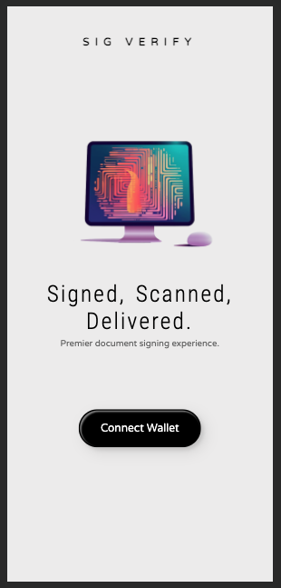

# XRP SigVerify: Blockchain Signature Validation Platform 📜🔒

Your premier platform for secure and transparent document signing and signature validation powered by the [XRP Ledger](https://xrpl.org). In an era defined by digital transactions, the integrity and authenticity of important documents are of utmost importance. While traditional methods falter in transparency and are prone to tampering, XRP SigVerify rises above by leveraging the robust features of blockchain technology.

## Embracing the XRPL's Strengths 💪

- **Decentralized Security**: Eliminating single points of failure.
- **Immutable Records**: Assuring the permanence and untampered state of signed documents.
- **Transparency**: Ensuring verifiable authenticity without intermediaries.
- **Fast and Economical Transactions**: Swift validations without exorbitant costs.
- **Global Reach**: Access and verify from anywhere in the world.
- **Cryptographic Excellence**: Ensuring top-tier security for all transactions.
- **Scalability**: Capable of handling high volumes seamlessly.
- **Future-Ready**: Poised to integrate smart contract capabilities as they evolve on the XRPL.

Building on the tried-and-tested foundation of the XRPL, we're not only enhancing trust in the document signing process but also streamlining development, aligning with our mission to provide the best in the domain.

## Preview Unfinished Mock Demo




<br />
<hr>

## Technologies 🛠

- **React**: Front-end framework.
- **Express.js**: Node.js framework for managing servers and routes.
- **Node**: JavaScript runtime.
- **Vue**: Front-end build environment.
- **Xrpl**: XRPL JavaScript library.
- **XummSdk**: Allow developers to deliver xrpl and other (sign-in) payloads to Xumm app users.

<br />
<hr>

## Current Functionalities 🌟

### Xumm Functionality
- Management of xrpl keypairs
- Wallet Authentication / Verification.
- Login authentication.
- Transaction signing.

### XRPL Functionality
- Transaction and document hash storage on ledger.
- Specified Transaction Queries.
- Signature Verification.
- Storing of document hashes in tx memo field.
- Immutable timestamped signature authentication.

### Base Functionality
- Document upload ( currently .pdf or .txt for mvp ).
- Document preview.
- Document Hashing (Sha-256).
- Profile drop-down based on authenticated wallet.
- Responsive design

<br />
<hr>

## Future Functionalities 🔮
- xumm push notifications for payloads after initial sign-in.
- User-friendly navigation.
- identity verification.
- Intuitive dashboard.
- multi - sig for documents.
- document editor.
- drag-and-drop document upload.
- document sharing in-app.
- detailed user profiles
- signature history
- upload / signature of all document types and more.
- customizable signature fields and visual signature templates.

<br />
<hr>

## Steps To Run Project

1. Clone the project from GitHub.
2. Navigate to the `sigVerify-frontend` directory in the terminal and run 'npm i' to install all front-end dependencies.
3. Navigate to the `sigVerify-backend` directory in the terminal and run 'npm i' to install all back-end dependencies.
4. Copy the `.env.dist` file in the root of the `sigVerify-backend` directory to create a new file named `.env`. Add your API key and secret for XUMM API in the `.env` file. <br />
   ```bash
   XUMM_API_KEY="api key here"
   XUMM_API_SECRET="api secret here"
   POSTGRES_HOST="sigverify-database"
   POSTGRES_USER="postgres"
   POSTGRES_PASSWORD="postgres"
   POSTGRES_DB="sigverifydb"

   MAIL_HOST="sigverify-mailcatcher"
   MAIL_PORT=1025
   MAIL_USERNAME=""
   MAIL_PASSWORD=""
   MAIL_FROM_ADDRESS="noreply@ledgerintegrations.com"
   MAIL_FROM_NAME="Ledger Integrations"
   ```
5. Execute 'docker-compose up -d' in the `sigVerify-backend` terminal.
6. Open a second terminal, navigate to `sigVerify-frontend`, and execute 'npm run dev' in the terminal. Then, navigate to the outputted localhost URL.
7. For current development and testing, switch XUMM's advanced setting to use XRPL test node: `wss://testnet.xrpl-labs.com`. The XRPL backend web socket is already pre-configured to the XRPL testnet: `wss://s.altnet.rippletest.net:51233` for you.


