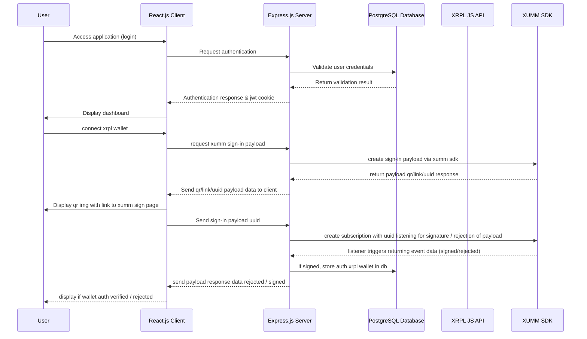

```mermaid
sequenceDiagram
    participant User as User
    participant Client as React.js Client
    participant Server as Express.js Server
    participant Database as PostgreSQL Database
    participant XRPL_API as XRPL JS API
    participant XUMM_SDK as XUMM SDK

    User->>Client: Access application (login)
    Client->>Server: Request authentication
    Server->>Database: Validate user credentials
    Database-->>Server: Return validation result
    Server-->>Client: Authentication response & jwt cookie
    Client->>User: Display dashboard

    User->>Client: connect xrpl wallet
    Client->>Server: request xumm sign-in payload
    Server->>XUMM_SDK: create sign-in payload via xumm sdk
    XUMM_SDK-->>Server: return payload qr/link/uuid response
    Server-->>Client: Send qr/link/uuid payload data to client
    Client->>User: Display qr img with link to xumm sign page
    Client->>Server: Send sign-in payload uuid
    Server->>XUMM_SDK: create subscription with uuid listening for signature / rejection of payload
    XUMM_SDK-->>Server: listener triggers returning event data (signed/rejected)
    Server->>Database: if signed, store auth xrpl wallet in db
    Server-->>Client: send payload response data rejected / signed
    Client-->>User: display if wallet auth verified / rejected
```
